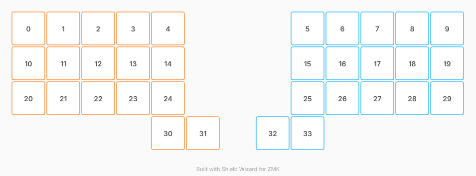

# ZMK Configuration for shonbord

*Generated by Shield Wizard for ZMK*



Download compiled firmware from the Actions tab. <https://zmk.dev/docs/user-setup#installing-the-firmware>

Edit your keymap <https://zmk.dev/docs/keymaps>.
User keymap is located at [`config/shonbord.keymap`](config/shonbord.keymap).

-----

<details>
<summary>
Shield Wizard Debug Information
</summary>

In case of broken configuration, here is the Shield Wizard internal data used to generate this configuration:

Commit: 91406f4c7cfc67b0f2b2639a4d61044ae69c7e60

```json
{"name":"shonbord","shield":"shonbord","dongle":true,"modules":[],"layout":[{"id":"01KYY1TTCD7P8QYK7SFJ3G79X8","part":0,"row":0,"col":0,"w":1,"h":1,"x":0,"y":0,"r":0,"rx":0,"ry":0},{"id":"01KYY1TTCD9CFXS28P3FD8B6G3","part":0,"row":0,"col":1,"w":1,"h":1,"x":1,"y":0,"r":0,"rx":0,"ry":0},{"id":"01KYY1TTCD08YQ2KXTN3QBZ5YV","part":0,"row":0,"col":2,"w":1,"h":1,"x":2,"y":0,"r":0,"rx":0,"ry":0},{"id":"01KYY1TTCD62VK5B45QJJP75FS","part":0,"row":0,"col":3,"w":1,"h":1,"x":3,"y":0,"r":0,"rx":0,"ry":0},{"id":"01KYY1TTCDT2JKHF15N81J3RXH","part":0,"row":0,"col":4,"w":1,"h":1,"x":4,"y":0,"r":0,"rx":0,"ry":0},{"id":"01KYY1TTCDJ3DBHX0KV4GEPT28","part":1,"row":0,"col":8,"w":1,"h":1,"x":8,"y":0,"r":0,"rx":0,"ry":0},{"id":"01KYY1TTCDMQSVCXSY8P7MDHTT","part":1,"row":0,"col":9,"w":1,"h":1,"x":9,"y":0,"r":0,"rx":0,"ry":0},{"id":"01KYY1TTCD5YSZNQ2W35ZRSCKP","part":1,"row":0,"col":10,"w":1,"h":1,"x":10,"y":0,"r":0,"rx":0,"ry":0},{"id":"01KYY1TTCDDD77DTDJF1PBKBDR","part":1,"row":0,"col":11,"w":1,"h":1,"x":11,"y":0,"r":0,"rx":0,"ry":0},{"id":"01KYY1TTCDFTXCABCB0EK74GGG","part":1,"row":0,"col":12,"w":1,"h":1,"x":12,"y":0,"r":0,"rx":0,"ry":0},{"id":"01KYY1TTCD47F50C3NH9S6SBE1","part":0,"row":1,"col":0,"w":1,"h":1,"x":0,"y":1,"r":0,"rx":0,"ry":0},{"id":"01KYY1TTCD5EVQYP2RBVQ6RVN7","part":0,"row":1,"col":1,"w":1,"h":1,"x":1,"y":1,"r":0,"rx":0,"ry":0},{"id":"01KYY1TTCD3J9K5H9K6JQYHDY7","part":0,"row":1,"col":2,"w":1,"h":1,"x":2,"y":1,"r":0,"rx":0,"ry":0},{"id":"01KYY1TTCD6NCSG1G21XWS2JNJ","part":0,"row":1,"col":3,"w":1,"h":1,"x":3,"y":1,"r":0,"rx":0,"ry":0},{"id":"01KYY1TTCDTDAFEREN1ECXWFHT","part":0,"row":1,"col":4,"w":1,"h":1,"x":4,"y":1,"r":0,"rx":0,"ry":0},{"id":"01KYY1TTCDKHWMTK672E0PH5VH","part":1,"row":1,"col":8,"w":1,"h":1,"x":8,"y":1,"r":0,"rx":0,"ry":0},{"id":"01KYY1TTCD9VGXFPSSJV871QKY","part":1,"row":1,"col":9,"w":1,"h":1,"x":9,"y":1,"r":0,"rx":0,"ry":0},{"id":"01KYY1TTCDH9H7R5FTN63NV73T","part":1,"row":1,"col":10,"w":1,"h":1,"x":10,"y":1,"r":0,"rx":0,"ry":0},{"id":"01KYY1TTCDTFBFF62XMM5WVB3G","part":1,"row":1,"col":11,"w":1,"h":1,"x":11,"y":1,"r":0,"rx":0,"ry":0},{"id":"01KYY1TTCDCP077KPKXJA56YME","part":1,"row":1,"col":12,"w":1,"h":1,"x":12,"y":1,"r":0,"rx":0,"ry":0},{"id":"01KYY1TTCDJJRWY9E24BY4MATK","part":0,"row":2,"col":0,"w":1,"h":1,"x":0,"y":2,"r":0,"rx":0,"ry":0},{"id":"01KYY1TTCDB2QACJT9H8314BH7","part":0,"row":2,"col":1,"w":1,"h":1,"x":1,"y":2,"r":0,"rx":0,"ry":0},{"id":"01KYY1TTCD2BJTY2NGGTJNYXPX","part":0,"row":2,"col":2,"w":1,"h":1,"x":2,"y":2,"r":0,"rx":0,"ry":0},{"id":"01KYY1TTCDDN3YNYWGQW3EQ15V","part":0,"row":2,"col":3,"w":1,"h":1,"x":3,"y":2,"r":0,"rx":0,"ry":0},{"id":"01KYY1TTCDPCXYQRRHHCSRR4VY","part":0,"row":2,"col":4,"w":1,"h":1,"x":4,"y":2,"r":0,"rx":0,"ry":0},{"id":"01KYY1TTCDTBCDJVMY252TSPHX","part":1,"row":2,"col":8,"w":1,"h":1,"x":8,"y":2,"r":0,"rx":0,"ry":0},{"id":"01KYY1TTCDA1EG37WG3M7E29CA","part":1,"row":2,"col":9,"w":1,"h":1,"x":9,"y":2,"r":0,"rx":0,"ry":0},{"id":"01KYY1TTCD31FZRMK79BQ4RH9H","part":1,"row":2,"col":10,"w":1,"h":1,"x":10,"y":2,"r":0,"rx":0,"ry":0},{"id":"01KYY1TTCD6X5GSQNWHXGBY7WP","part":1,"row":2,"col":11,"w":1,"h":1,"x":11,"y":2,"r":0,"rx":0,"ry":0},{"id":"01KYY1TTCD9ZDZWZZHH2AMWR64","part":1,"row":2,"col":12,"w":1,"h":1,"x":12,"y":2,"r":0,"rx":0,"ry":0},{"id":"01KYY1TTCDW057HJ2YXGCS57SQ","part":0,"row":3,"col":4,"w":1,"h":1,"x":4,"y":3,"r":0,"rx":0,"ry":0},{"id":"01KYY1TTCDA1S2BTEQE2AB8M13","part":0,"row":3,"col":5,"w":1,"h":1,"x":5,"y":3,"r":0,"rx":8.776316,"ry":1.677632},{"id":"01KYY1TTCD56JVGR5FSXF7GMZS","part":1,"row":3,"col":7,"w":1,"h":1,"x":7,"y":3,"r":0,"rx":0,"ry":0},{"id":"01KYY1TTCDFTDZD23GY817QNMN","part":1,"row":3,"col":8,"w":1,"h":1,"x":8,"y":3,"r":0,"rx":0,"ry":0}],"parts":[{"name":"left","controller":"nice_nano_v2","pins":{"d1":{"usage":"kscan","kscan":"01KYY614MM4R7BG453N9JVA11S","role":"input"},"d0":{"usage":"kscan","kscan":"01KYY614MM4R7BG453N9JVA11S","role":"input"},"d21":{"usage":"kscan","kscan":"01KYY614MM4R7BG453N9JVA11S","role":"input"},"d20":{"usage":"kscan","kscan":"01KYY614MM4R7BG453N9JVA11S","role":"input"},"d19":{"usage":"kscan","kscan":"01KYY614MM4R7BG453N9JVA11S","role":"input"},"d18":{"usage":"kscan","kscan":"01KYY614MM4R7BG453N9JVA11S","role":"input"},"d15":{"usage":"kscan","kscan":"01KYY614MM4R7BG453N9JVA11S","role":"input"},"d14":{"usage":"kscan","kscan":"01KYY614MM4R7BG453N9JVA11S","role":"input"},"d16":{"usage":"kscan","kscan":"01KYY614MM4R7BG453N9JVA11S","role":"input"},"d10":{"usage":"kscan","kscan":"01KYY614MM4R7BG453N9JVA11S","role":"input"},"d3":{"usage":"kscan","kscan":"01KYY614MM4R7BG453N9JVA11S","role":"input"},"d4":{"usage":"kscan","kscan":"01KYY614MM4R7BG453N9JVA11S","role":"input"},"d5":{"usage":"kscan","kscan":"01KYY614MM4R7BG453N9JVA11S","role":"input"},"d6":{"usage":"kscan","kscan":"01KYY614MM4R7BG453N9JVA11S","role":"input"},"d7":{"usage":"kscan","kscan":"01KYY614MM4R7BG453N9JVA11S","role":"input"},"d8":{"usage":"kscan","kscan":"01KYY614MM4R7BG453N9JVA11S","role":"input"},"d9":{"usage":"kscan","kscan":"01KYY614MM4R7BG453N9JVA11S","role":"input"}},"kscans":[{"kind":"direct","id":"01KYY614MM4R7BG453N9JVA11S","mode":"gnd"}],"keys":{"01KYY1TTCDT2JKHF15N81J3RXH":{"input":"d1"},"01KYY1TTCD62VK5B45QJJP75FS":{"input":"d0"},"01KYY1TTCD08YQ2KXTN3QBZ5YV":{"input":"d21"},"01KYY1TTCD9CFXS28P3FD8B6G3":{"input":"d20"},"01KYY1TTCD7P8QYK7SFJ3G79X8":{"input":"d19"},"01KYY1TTCD5EVQYP2RBVQ6RVN7":{"input":"d18"},"01KYY1TTCD3J9K5H9K6JQYHDY7":{"input":"d15"},"01KYY1TTCD6NCSG1G21XWS2JNJ":{"input":"d14"},"01KYY1TTCDTDAFEREN1ECXWFHT":{"input":"d16"},"01KYY1TTCDJJRWY9E24BY4MATK":{"input":"d10"},"01KYY1TTCD47F50C3NH9S6SBE1":{"input":"d3"},"01KYY1TTCDB2QACJT9H8314BH7":{"input":"d4"},"01KYY1TTCD2BJTY2NGGTJNYXPX":{"input":"d5"},"01KYY1TTCDDN3YNYWGQW3EQ15V":{"input":"d6"},"01KYY1TTCDPCXYQRRHHCSRR4VY":{"input":"d7"},"01KYY1TTCDW057HJ2YXGCS57SQ":{"input":"d8"},"01KYY1TTCDA1S2BTEQE2AB8M13":{"input":"d9"}},"encoders":[],"buses":{}},{"name":"right","controller":"nice_nano_v2","pins":{"d1":{"usage":"kscan","kscan":"01KYY6FS3R9DDW4CM38W1MZMY0","role":"input"},"d0":{"usage":"kscan","kscan":"01KYY6FS3R9DDW4CM38W1MZMY0","role":"input"},"d2":{"usage":"kscan","kscan":"01KYY6FS3R9DDW4CM38W1MZMY0","role":"input"},"d3":{"usage":"kscan","kscan":"01KYY6FS3R9DDW4CM38W1MZMY0","role":"input"},"d4":{"usage":"kscan","kscan":"01KYY6FS3R9DDW4CM38W1MZMY0","role":"input"},"d5":{"usage":"kscan","kscan":"01KYY6FS3R9DDW4CM38W1MZMY0","role":"input"},"d6":{"usage":"kscan","kscan":"01KYY6FS3R9DDW4CM38W1MZMY0","role":"input"},"d7":{"usage":"kscan","kscan":"01KYY6FS3R9DDW4CM38W1MZMY0","role":"input"},"d8":{"usage":"kscan","kscan":"01KYY6FS3R9DDW4CM38W1MZMY0","role":"input"},"d9":{"usage":"kscan","kscan":"01KYY6FS3R9DDW4CM38W1MZMY0","role":"input"},"d10":{"usage":"kscan","kscan":"01KYY6FS3R9DDW4CM38W1MZMY0","role":"input"},"d16":{"usage":"kscan","kscan":"01KYY6FS3R9DDW4CM38W1MZMY0","role":"input"},"d14":{"usage":"kscan","kscan":"01KYY6FS3R9DDW4CM38W1MZMY0","role":"input"},"d15":{"usage":"kscan","kscan":"01KYY6FS3R9DDW4CM38W1MZMY0","role":"input"},"d18":{"usage":"kscan","kscan":"01KYY6FS3R9DDW4CM38W1MZMY0","role":"input"},"d19":{"usage":"kscan","kscan":"01KYY6FS3R9DDW4CM38W1MZMY0","role":"input"},"d20":{"usage":"kscan","kscan":"01KYY6FS3R9DDW4CM38W1MZMY0","role":"input"}},"kscans":[{"kind":"direct","id":"01KYY6FS3R9DDW4CM38W1MZMY0","mode":"gnd"}],"keys":{"01KYY1TTCDJ3DBHX0KV4GEPT28":{"input":"d1"},"01KYY1TTCDMQSVCXSY8P7MDHTT":{"input":"d0"},"01KYY1TTCD5YSZNQ2W35ZRSCKP":{"input":"d2"},"01KYY1TTCDDD77DTDJF1PBKBDR":{"input":"d3"},"01KYY1TTCDFTXCABCB0EK74GGG":{"input":"d4"},"01KYY1TTCDTFBFF62XMM5WVB3G":{"input":"d5"},"01KYY1TTCDH9H7R5FTN63NV73T":{"input":"d6"},"01KYY1TTCD9VGXFPSSJV871QKY":{"input":"d7"},"01KYY1TTCDKHWMTK672E0PH5VH":{"input":"d8"},"01KYY1TTCD9ZDZWZZHH2AMWR64":{"input":"d9"},"01KYY1TTCD56JVGR5FSXF7GMZS":{"input":"d10"},"01KYY1TTCDFTDZD23GY817QNMN":{"input":"d16"},"01KYY1TTCDTBCDJVMY252TSPHX":{"input":"d14"},"01KYY1TTCDA1EG37WG3M7E29CA":{"input":"d15"},"01KYY1TTCD31FZRMK79BQ4RH9H":{"input":"d18"},"01KYY1TTCD6X5GSQNWHXGBY7WP":{"input":"d19"},"01KYY1TTCDCP077KPKXJA56YME":{"input":"d20"}},"encoders":[],"buses":{}}]}
```

</details>
